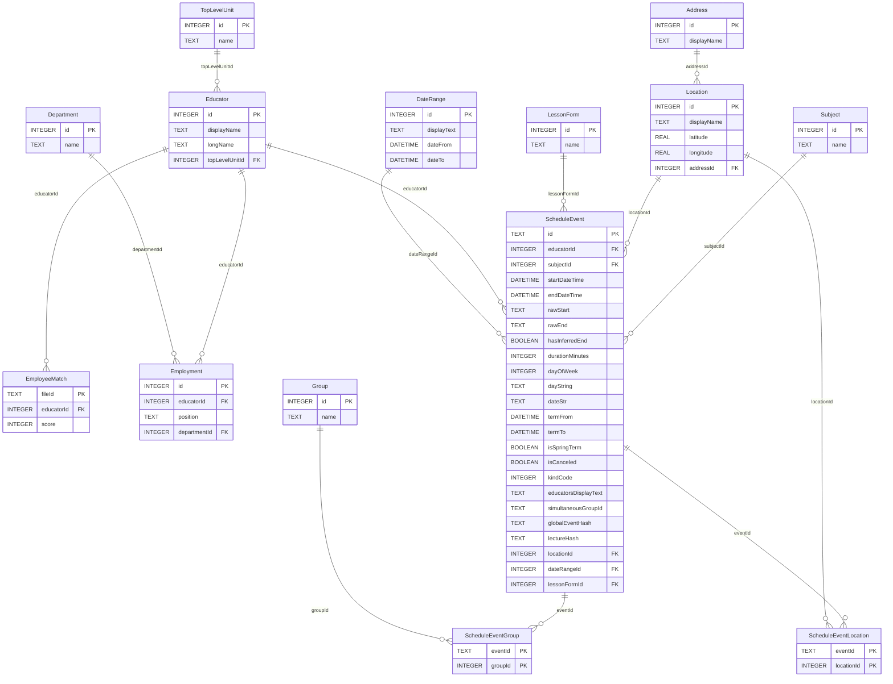

# Схема базы данных

_Сгенерировано `2026-09-19T11:38:25.387Z` (SQLite) скриптом `bun run db:schema`._

Таблиц: **14**. Строк всего: **87 604**.

## ER-диаграмма

Обозначения: `PK` — первичный ключ, `FK` — внешний ключ. Связь `A ||--o{ B` — «один A → много B».

## Таблицы

### Address

Строк: **33**.

| Колонка | Тип | NULL | По умолчанию | Ключ |
|---|---|---|---|---|
| `id` | INTEGER | NO | — | PK |
| `displayName` | TEXT | NO | — | UNIQUE |

**Индексы:**

- `Address_displayName_idx` → `displayName`
- `Address_displayName_key` (UNIQUE) → `displayName`

### DateRange

Строк: **2**.

| Колонка | Тип | NULL | По умолчанию | Ключ |
|---|---|---|---|---|
| `id` | INTEGER | NO | — | PK |
| `displayText` | TEXT | NO | — | UNIQUE |
| `dateFrom` | DATETIME | NO | — | — |
| `dateTo` | DATETIME | NO | — | — |

**Индексы:**

- `DateRange_dateFrom_dateTo_idx` → `dateFrom, dateTo`
- `DateRange_displayText_key` (UNIQUE) → `displayText`

### Department

Строк: **1 014**.

| Колонка | Тип | NULL | По умолчанию | Ключ |
|---|---|---|---|---|
| `id` | INTEGER | NO | — | PK |
| `name` | TEXT | NO | — | UNIQUE |

**Индексы:**

- `Department_name_idx` → `name`
- `Department_name_key` (UNIQUE) → `name`

### TopLevelUnit

Строк: **31**.

| Колонка | Тип | NULL | По умолчанию | Ключ |
|---|---|---|---|---|
| `id` | INTEGER | NO | — | PK |
| `name` | TEXT | NO | — | UNIQUE |

**Индексы:**

- `TopLevelUnit_name_idx` → `name`
- `TopLevelUnit_name_key` (UNIQUE) → `name`

### Educator

Строк: **12 650**.

| Колонка | Тип | NULL | По умолчанию | Ключ |
|---|---|---|---|---|
| `id` | INTEGER | NO | — | PK |
| `displayName` | TEXT | NO | — | — |
| `longName` | TEXT | NO | — | — |
| `topLevelUnitId` | INTEGER | YES | — | FK |

**Индексы:**

- `Educator_topLevelUnitId_idx` → `topLevelUnitId`

**Внешние ключи:**

- `topLevelUnitId` → `TopLevelUnit.id`

### EmployeeMatch

Строк: **4 282**.

| Колонка | Тип | NULL | По умолчанию | Ключ |
|---|---|---|---|---|
| `fileId` | TEXT | NO | — | PK |
| `educatorId` | INTEGER | NO | — | FK |
| `score` | INTEGER | NO | — | — |

**Индексы:**

- `EmployeeMatch_educatorId_idx` → `educatorId`

**Внешние ключи:**

- `educatorId` → `Educator.id`

### Employment

Строк: **25 092**.

| Колонка | Тип | NULL | По умолчанию | Ключ |
|---|---|---|---|---|
| `id` | INTEGER | NO | — | PK |
| `educatorId` | INTEGER | NO | — | FK |
| `position` | TEXT | NO | — | — |
| `departmentId` | INTEGER | YES | — | FK |

**Индексы:**

- `Employment_educatorId_position_departmentId_key` (UNIQUE) → `educatorId, position, departmentId`
- `Employment_departmentId_idx` → `departmentId`
- `Employment_position_idx` → `position`
- `Employment_educatorId_idx` → `educatorId`

**Внешние ключи:**

- `departmentId` → `Department.id`
- `educatorId` → `Educator.id`

### Group

Строк: **1 526**.

| Колонка | Тип | NULL | По умолчанию | Ключ |
|---|---|---|---|---|
| `id` | INTEGER | NO | — | PK |
| `name` | TEXT | NO | — | UNIQUE |

**Индексы:**

- `Group_name_idx` → `name`
- `Group_name_key` (UNIQUE) → `name`

### LessonForm

Строк: **23**.

| Колонка | Тип | NULL | По умолчанию | Ключ |
|---|---|---|---|---|
| `id` | INTEGER | NO | — | PK |
| `name` | TEXT | NO | — | UNIQUE |

**Индексы:**

- `LessonForm_name_idx` → `name`
- `LessonForm_name_key` (UNIQUE) → `name`

### Location

Строк: **517**.

| Колонка | Тип | NULL | По умолчанию | Ключ |
|---|---|---|---|---|
| `id` | INTEGER | NO | — | PK |
| `displayName` | TEXT | NO | — | UNIQUE |
| `latitude` | REAL | YES | — | — |
| `longitude` | REAL | YES | — | — |
| `addressId` | INTEGER | YES | — | FK |

**Индексы:**

- `Location_addressId_idx` → `addressId`
- `Location_displayName_idx` → `displayName`
- `Location_displayName_key` (UNIQUE) → `displayName`

**Внешние ключи:**

- `addressId` → `Address.id`

### Subject

Строк: **1 836**.

| Колонка | Тип | NULL | По умолчанию | Ключ |
|---|---|---|---|---|
| `id` | INTEGER | NO | — | PK |
| `name` | TEXT | NO | — | UNIQUE |

**Индексы:**

- `Subject_name_idx` → `name`
- `Subject_name_key` (UNIQUE) → `name`

### ScheduleEvent

Строк: **18 798**.

| Колонка | Тип | NULL | По умолчанию | Ключ |
|---|---|---|---|---|
| `id` | TEXT | NO | — | PK |
| `educatorId` | INTEGER | NO | — | FK |
| `subjectId` | INTEGER | NO | — | FK |
| `startDateTime` | DATETIME | NO | — | — |
| `endDateTime` | DATETIME | NO | — | — |
| `rawStart` | TEXT | NO | — | — |
| `rawEnd` | TEXT | YES | — | — |
| `hasInferredEnd` | BOOLEAN | NO | `false` | — |
| `durationMinutes` | INTEGER | NO | — | — |
| `dayOfWeek` | INTEGER | NO | — | — |
| `dayString` | TEXT | NO | — | — |
| `dateStr` | TEXT | NO | — | — |
| `termFrom` | DATETIME | NO | — | — |
| `termTo` | DATETIME | NO | — | — |
| `isSpringTerm` | BOOLEAN | NO | — | — |
| `isCanceled` | BOOLEAN | NO | `false` | — |
| `kindCode` | INTEGER | NO | `0` | — |
| `educatorsDisplayText` | TEXT | NO | — | — |
| `simultaneousGroupId` | TEXT | YES | — | — |
| `globalEventHash` | TEXT | NO | — | — |
| `lectureHash` | TEXT | NO | — | — |
| `locationId` | INTEGER | YES | — | FK |
| `dateRangeId` | INTEGER | YES | — | FK |
| `lessonFormId` | INTEGER | YES | — | FK |

**Индексы:**

- `ScheduleEvent_educatorId_startDateTime_subjectId_globalEventHash_key` (UNIQUE) → `educatorId, startDateTime, subjectId, globalEventHash`
- `ScheduleEvent_lessonFormId_idx` → `lessonFormId`
- `ScheduleEvent_dateRangeId_idx` → `dateRangeId`
- `ScheduleEvent_locationId_idx` → `locationId`
- `ScheduleEvent_kindCode_idx` → `kindCode`
- `ScheduleEvent_lectureHash_idx` → `lectureHash`
- `ScheduleEvent_globalEventHash_idx` → `globalEventHash`
- `ScheduleEvent_simultaneousGroupId_idx` → `simultaneousGroupId`
- `ScheduleEvent_subjectId_idx` → `subjectId`
- `ScheduleEvent_endDateTime_idx` → `endDateTime`
- `ScheduleEvent_startDateTime_idx` → `startDateTime`
- `ScheduleEvent_educatorId_startDateTime_idx` → `educatorId, startDateTime`

**Внешние ключи:**

- `lessonFormId` → `LessonForm.id`
- `dateRangeId` → `DateRange.id`
- `locationId` → `Location.id`
- `subjectId` → `Subject.id`
- `educatorId` → `Educator.id`

### ScheduleEventGroup

Строк: **18 601**.

| Колонка | Тип | NULL | По умолчанию | Ключ |
|---|---|---|---|---|
| `eventId` | TEXT | NO | — | PK, FK |
| `groupId` | INTEGER | NO | — | PK, FK |

**Индексы:**

- `ScheduleEventGroup_groupId_idx` → `groupId`

**Внешние ключи:**

- `groupId` → `Group.id`
- `eventId` → `ScheduleEvent.id`

### ScheduleEventLocation

Строк: **3 199**.

| Колонка | Тип | NULL | По умолчанию | Ключ |
|---|---|---|---|---|
| `eventId` | TEXT | NO | — | PK, FK |
| `locationId` | INTEGER | NO | — | PK, FK |

**Индексы:**

- `ScheduleEventLocation_locationId_idx` → `locationId`

**Внешние ключи:**

- `locationId` → `Location.id`
- `eventId` → `ScheduleEvent.id`
