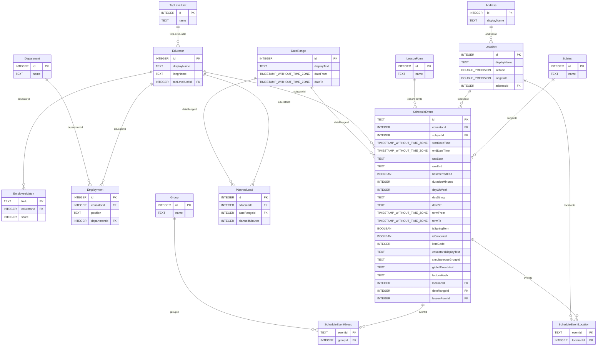

# Схема базы данных

_Сгенерировано `2026-09-26T21:46:20.627Z` (PostgreSQL) скриптом `bun run db:schema`._

Таблиц: **15**. Строк всего: **1 862 499**.

## ER-диаграмма

```mermaid
erDiagram
  Address {
    INTEGER id PK
    TEXT displayName
  }
  DateRange {
    INTEGER id PK
    TEXT displayText
    TIMESTAMP_WITHOUT_TIME_ZONE dateFrom
    TIMESTAMP_WITHOUT_TIME_ZONE dateTo
  }
  Department {
    INTEGER id PK
    TEXT name
  }
  TopLevelUnit {
    INTEGER id PK
    TEXT name
  }
  Educator {
    INTEGER id PK
    TEXT displayName
    TEXT longName
    INTEGER topLevelUnitId FK
  }
  EmployeeMatch {
    TEXT fileId PK
    INTEGER educatorId FK
    INTEGER score
  }
  Employment {
    INTEGER id PK
    INTEGER educatorId FK
    TEXT position
    INTEGER departmentId FK
  }
  Group {
    INTEGER id PK
    TEXT name
  }
  LessonForm {
    INTEGER id PK
    TEXT name
  }
  Location {
    INTEGER id PK
    TEXT displayName
    DOUBLE_PRECISION latitude
    DOUBLE_PRECISION longitude
    INTEGER addressId FK
  }
  PlannedLoad {
    INTEGER id PK
    INTEGER educatorId FK
    INTEGER dateRangeId FK
    INTEGER plannedMinutes
  }
  Subject {
    INTEGER id PK
    TEXT name
  }
  ScheduleEvent {
    TEXT id PK
    INTEGER educatorId FK
    INTEGER subjectId FK
    TIMESTAMP_WITHOUT_TIME_ZONE startDateTime
    TIMESTAMP_WITHOUT_TIME_ZONE endDateTime
    TEXT rawStart
    TEXT rawEnd
    BOOLEAN hasInferredEnd
    INTEGER durationMinutes
    INTEGER dayOfWeek
    TEXT dayString
    TEXT dateStr
    TIMESTAMP_WITHOUT_TIME_ZONE termFrom
    TIMESTAMP_WITHOUT_TIME_ZONE termTo
    BOOLEAN isSpringTerm
    BOOLEAN isCanceled
    INTEGER kindCode
    TEXT educatorsDisplayText
    TEXT simultaneousGroupId
    TEXT globalEventHash
    TEXT lectureHash
    INTEGER locationId FK
    INTEGER dateRangeId FK
    INTEGER lessonFormId FK
  }
  ScheduleEventGroup {
    TEXT eventId PK
    INTEGER groupId PK
  }
  ScheduleEventLocation {
    TEXT eventId PK
    INTEGER locationId PK
  }

  Address ||--o{ Location : "addressId"
  DateRange ||--o{ PlannedLoad : "dateRangeId"
  DateRange ||--o{ ScheduleEvent : "dateRangeId"
  Department ||--o{ Employment : "departmentId"
  Educator ||--o{ EmployeeMatch : "educatorId"
  Educator ||--o{ Employment : "educatorId"
  Educator ||--o{ PlannedLoad : "educatorId"
  Educator ||--o{ ScheduleEvent : "educatorId"
  Group ||--o{ ScheduleEventGroup : "groupId"
  LessonForm ||--o{ ScheduleEvent : "lessonFormId"
  Location ||--o{ ScheduleEvent : "locationId"
  Location ||--o{ ScheduleEventLocation : "locationId"
  ScheduleEvent ||--o{ ScheduleEventGroup : "eventId"
  ScheduleEvent ||--o{ ScheduleEventLocation : "eventId"
  Subject ||--o{ ScheduleEvent : "subjectId"
  TopLevelUnit ||--o{ Educator : "topLevelUnitId"
```

Обозначения: `PK` — первичный ключ, `FK` — внешний ключ. Связь `A ||--o{ B` — «один A → много B».

## Таблицы

### Address

Строк: **159**.

| Колонка | Тип | NULL | По умолчанию | Ключ |
|---|---|---|---|---|
| `id` | INTEGER | NO | `nextval('"Address_id_seq"'::regclass)` | PK |
| `displayName` | TEXT | NO | — | UNIQUE |

**Индексы:**

- `Address_displayName_key` (UNIQUE) → `displayName`
- `Address_displayName_idx` → `displayName`

### DateRange

Строк: **2**.

| Колонка | Тип | NULL | По умолчанию | Ключ |
|---|---|---|---|---|
| `id` | INTEGER | NO | `nextval('"DateRange_id_seq"'::regclass)` | PK |
| `displayText` | TEXT | NO | — | UNIQUE |
| `dateFrom` | TIMESTAMP WITHOUT TIME ZONE | NO | — | — |
| `dateTo` | TIMESTAMP WITHOUT TIME ZONE | NO | — | — |

**Индексы:**

- `DateRange_displayText_key` (UNIQUE) → `displayText`
- `DateRange_dateFrom_dateTo_idx` → `dateFrom, dateTo`

### Department

Строк: **1 014**.

| Колонка | Тип | NULL | По умолчанию | Ключ |
|---|---|---|---|---|
| `id` | INTEGER | NO | `nextval('"Department_id_seq"'::regclass)` | PK |
| `name` | TEXT | NO | — | UNIQUE |

**Индексы:**

- `Department_name_key` (UNIQUE) → `name`
- `Department_name_idx` → `name`

### TopLevelUnit

Строк: **45**.

| Колонка | Тип | NULL | По умолчанию | Ключ |
|---|---|---|---|---|
| `id` | INTEGER | NO | `nextval('"TopLevelUnit_id_seq"'::regclass)` | PK |
| `name` | TEXT | NO | — | UNIQUE |

**Индексы:**

- `TopLevelUnit_name_key` (UNIQUE) → `name`
- `TopLevelUnit_name_idx` → `name`

### Educator

Строк: **5 166**.

| Колонка | Тип | NULL | По умолчанию | Ключ |
|---|---|---|---|---|
| `id` | INTEGER | NO | — | PK |
| `displayName` | TEXT | NO | — | — |
| `longName` | TEXT | NO | — | — |
| `topLevelUnitId` | INTEGER | YES | — | FK |

**Индексы:**

- `Educator_topLevelUnitId_idx` → `topLevelUnitId`

**Внешние ключи:**

- `topLevelUnitId` → `TopLevelUnit.id`

### EmployeeMatch

Строк: **3 709**.

| Колонка | Тип | NULL | По умолчанию | Ключ |
|---|---|---|---|---|
| `fileId` | TEXT | NO | — | PK |
| `educatorId` | INTEGER | NO | — | FK |
| `score` | INTEGER | NO | — | — |

**Индексы:**

- `EmployeeMatch_educatorId_idx` → `educatorId`

**Внешние ключи:**

- `educatorId` → `Educator.id`

### Employment

Строк: **13 937**.

| Колонка | Тип | NULL | По умолчанию | Ключ |
|---|---|---|---|---|
| `id` | INTEGER | NO | `nextval('"Employment_id_seq"'::regclass)` | PK |
| `educatorId` | INTEGER | NO | — | FK |
| `position` | TEXT | NO | — | — |
| `departmentId` | INTEGER | YES | — | FK |

**Индексы:**

- `Employment_educatorId_idx` → `educatorId`
- `Employment_position_idx` → `position`
- `Employment_departmentId_idx` → `departmentId`
- `Employment_educatorId_position_departmentId_key` (UNIQUE) → `educatorId, position, departmentId`

**Внешние ключи:**

- `educatorId` → `Educator.id`
- `departmentId` → `Department.id`

### Group

Строк: **22 814**.

| Колонка | Тип | NULL | По умолчанию | Ключ |
|---|---|---|---|---|
| `id` | INTEGER | NO | `nextval('"Group_id_seq"'::regclass)` | PK |
| `name` | TEXT | NO | — | UNIQUE |

**Индексы:**

- `Group_name_key` (UNIQUE) → `name`
- `Group_name_idx` → `name`

### LessonForm

Строк: **29**.

| Колонка | Тип | NULL | По умолчанию | Ключ |
|---|---|---|---|---|
| `id` | INTEGER | NO | `nextval('"LessonForm_id_seq"'::regclass)` | PK |
| `name` | TEXT | NO | — | UNIQUE |

**Индексы:**

- `LessonForm_name_key` (UNIQUE) → `name`
- `LessonForm_name_idx` → `name`

### Location

Строк: **2 016**.

| Колонка | Тип | NULL | По умолчанию | Ключ |
|---|---|---|---|---|
| `id` | INTEGER | NO | `nextval('"Location_id_seq"'::regclass)` | PK |
| `displayName` | TEXT | NO | — | UNIQUE |
| `latitude` | DOUBLE PRECISION | YES | — | — |
| `longitude` | DOUBLE PRECISION | YES | — | — |
| `addressId` | INTEGER | YES | — | FK |

**Индексы:**

- `Location_displayName_key` (UNIQUE) → `displayName`
- `Location_displayName_idx` → `displayName`
- `Location_addressId_idx` → `addressId`

**Внешние ключи:**

- `addressId` → `Address.id`

### PlannedLoad

Строк: **6 977**.

| Колонка | Тип | NULL | По умолчанию | Ключ |
|---|---|---|---|---|
| `id` | INTEGER | NO | `nextval('"PlannedLoad_id_seq"'::regclass)` | PK |
| `educatorId` | INTEGER | NO | — | FK |
| `dateRangeId` | INTEGER | NO | — | FK |
| `plannedMinutes` | INTEGER | NO | — | — |

**Индексы:**

- `PlannedLoad_dateRangeId_idx` → `dateRangeId`
- `PlannedLoad_educatorId_dateRangeId_key` (UNIQUE) → `educatorId, dateRangeId`

**Внешние ключи:**

- `educatorId` → `Educator.id`
- `dateRangeId` → `DateRange.id`

### Subject

Строк: **55 732**.

| Колонка | Тип | NULL | По умолчанию | Ключ |
|---|---|---|---|---|
| `id` | INTEGER | NO | `nextval('"Subject_id_seq"'::regclass)` | PK |
| `name` | TEXT | NO | — | UNIQUE |

**Индексы:**

- `Subject_name_key` (UNIQUE) → `name`
- `Subject_name_idx` → `name`

### ScheduleEvent

Строк: **844 737**.

| Колонка | Тип | NULL | По умолчанию | Ключ |
|---|---|---|---|---|
| `id` | TEXT | NO | — | PK |
| `educatorId` | INTEGER | NO | — | FK |
| `subjectId` | INTEGER | NO | — | FK |
| `startDateTime` | TIMESTAMP WITHOUT TIME ZONE | NO | — | — |
| `endDateTime` | TIMESTAMP WITHOUT TIME ZONE | NO | — | — |
| `rawStart` | TEXT | NO | — | — |
| `rawEnd` | TEXT | YES | — | — |
| `hasInferredEnd` | BOOLEAN | NO | `false` | — |
| `durationMinutes` | INTEGER | NO | — | — |
| `dayOfWeek` | INTEGER | NO | — | — |
| `dayString` | TEXT | NO | — | — |
| `dateStr` | TEXT | NO | — | — |
| `termFrom` | TIMESTAMP WITHOUT TIME ZONE | NO | — | — |
| `termTo` | TIMESTAMP WITHOUT TIME ZONE | NO | — | — |
| `isSpringTerm` | BOOLEAN | NO | — | — |
| `isCanceled` | BOOLEAN | NO | `false` | — |
| `kindCode` | INTEGER | NO | `0` | — |
| `educatorsDisplayText` | TEXT | NO | — | — |
| `simultaneousGroupId` | TEXT | YES | — | — |
| `globalEventHash` | TEXT | NO | — | — |
| `lectureHash` | TEXT | NO | — | — |
| `locationId` | INTEGER | YES | — | FK |
| `dateRangeId` | INTEGER | YES | — | FK |
| `lessonFormId` | INTEGER | YES | — | FK |

**Индексы:**

- `ScheduleEvent_educatorId_startDateTime_idx` → `educatorId, startDateTime`
- `ScheduleEvent_startDateTime_idx` → `startDateTime`
- `ScheduleEvent_endDateTime_idx` → `endDateTime`
- `ScheduleEvent_subjectId_idx` → `subjectId`
- `ScheduleEvent_simultaneousGroupId_idx` → `simultaneousGroupId`
- `ScheduleEvent_globalEventHash_idx` → `globalEventHash`
- `ScheduleEvent_lectureHash_idx` → `lectureHash`
- `ScheduleEvent_kindCode_idx` → `kindCode`
- `ScheduleEvent_locationId_idx` → `locationId`
- `ScheduleEvent_dateRangeId_idx` → `dateRangeId`
- `ScheduleEvent_lessonFormId_idx` → `lessonFormId`
- `ScheduleEvent_educatorId_startDateTime_subjectId_globalEven_key` (UNIQUE) → `educatorId, startDateTime, subjectId, globalEventHash`

**Внешние ключи:**

- `educatorId` → `Educator.id`
- `subjectId` → `Subject.id`
- `locationId` → `Location.id`
- `dateRangeId` → `DateRange.id`
- `lessonFormId` → `LessonForm.id`

### ScheduleEventGroup

Строк: **831 400**.

| Колонка | Тип | NULL | По умолчанию | Ключ |
|---|---|---|---|---|
| `eventId` | TEXT | NO | — | PK, FK |
| `groupId` | INTEGER | NO | — | PK, FK |

**Индексы:**

- `ScheduleEventGroup_groupId_idx` → `groupId`

**Внешние ключи:**

- `eventId` → `ScheduleEvent.id`
- `groupId` → `Group.id`

### ScheduleEventLocation

Строк: **74 762**.

| Колонка | Тип | NULL | По умолчанию | Ключ |
|---|---|---|---|---|
| `eventId` | TEXT | NO | — | PK, FK |
| `locationId` | INTEGER | NO | — | PK, FK |

**Индексы:**

- `ScheduleEventLocation_locationId_idx` → `locationId`

**Внешние ключи:**

- `eventId` → `ScheduleEvent.id`
- `locationId` → `Location.id`
